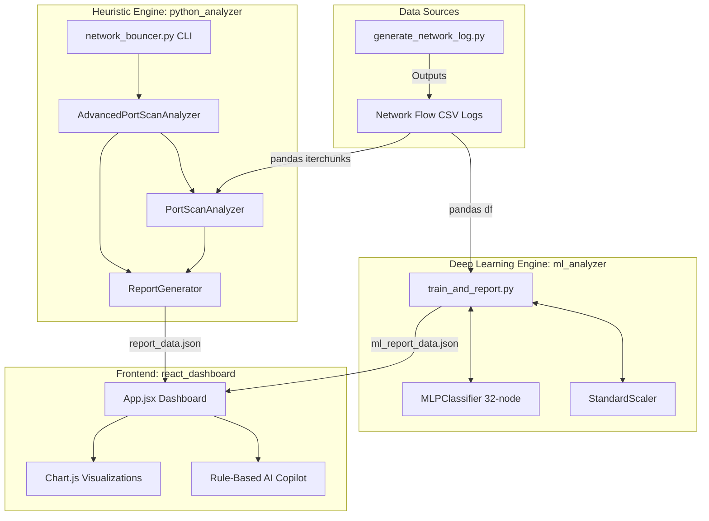

# Comprehensive Architecture & Project Analysis
**Network Bouncer NIDS**

This document provides a highly detailed analysis of the **Network Bouncer**, a hybrid Network Intrusion Detection System (NIDS). The system combines rule-based sliding-window heuristics and Deep Learning (Multi-Layer Perceptron) to detect port scanning, reconnaissance, and backdoor campaigns in network traffic (specifically UNSW-NB15 styled datasets).

---

## 1. High-Level Architecture Diagram

---

## 2. The Heuristic Engine (`/python_analyzer`)

The heuristic engine uses a sliding-window time-based approach to monitor network flows sequentially and attribute behaviors to Source IPs.

### Component Details
*   **`network_bouncer.py` (Entry Point):** 
    *   Provides a rich CLI interface with ASCII art.
    *   Accepts arguments for tuning all threshold parameters.
    *   Chunks large CSVs (default `100000` rows) to prevent memory overload.
    *   Calls `AdvancedPortScanAnalyzer` and uses `ReportGenerator` to output `suspicious_ips_report.csv` and `report_data.json`.
*   **`analyzer.py` (Base Logic):** 
    *   **Data Parsing (`detect_headers_and_indices`):** Dynamically detects if the CSV has headers. If not, it assumes the 49-column standard UNSW-NB15 format and maps indices.
    *   **State Tracking:** Maintains a `deque` of `(timestamp, dstip, dsport)` per source IP. Pops items older than `window_size` (default 60s) to maintain a live sliding window.
    *   **Classification Logic & Thresholds:**
        *   **Vertical Port Scan:** Scanned >= `20` unique ports on a *single host* in 60s. (Severity: High)
        *   **Horizontal Port Scan:** Scanned >= `30` unique destination IPs in 60s. (Severity: High)
        *   **Strobe Port Scan:** >= `10` hosts AND >= `10` ports in 60s. (Severity: High)
        *   **High-Rate Connection Anomaly:** >= `10` conns/sec AND total conns >= 50. (Severity: Medium)
        *   **Stealth Scan (High Failed Conn Ratio):** >= 30 total conns AND >= 85% of states are `REQ`, `INT`, or `RST` AND >= 10 unique ports. (Severity: Medium)
        *   **Backdoor Heuristic:** Any connection to C2 ports `{4444, 6667, 8000, 8080, 9999}` when total flows < 20. (Severity: Medium)
*   **`advanced_analyzer.py` (Correlation Logic):**
    *   Inherits from `analyzer.py`.
    *   **Distributed Scan Campaign:** Tracks `(dstip, dsport)` globally. If >= `3` unique source IPs hit the same target within `300s`, flags all involved IPs.
    *   **Slow Port Scan:** Scanned >= `10` ports at a rate <= `0.05` conns/sec over a timespan >= `300s`.
    *   **Common Ports Probe:** Scans common ports `{21, 22, 23, 80, 443, 445, 1433, 3306, 3389, 8080}` across >= `5` distinct hosts.
    *   **Benign Service Crawler:** High payload density (bytes/flow > 100k AND pkts/flow > 200 AND unique ports < 5) to filter out false positives.

---

## 3. The Deep Learning Engine (`/ml_analyzer`)

This acts as a parallel pipeline to evaluate the same network logs using supervised machine learning rather than strict rules.

### Component Details
*   **`train_and_report.py`:**
    *   **Data Source:** Relies on `UNSW_NB15_training-set.csv` (from the `archive` folder) to train, and `UNSW-NB15_2.csv` for inference.
    *   **Feature Extraction:** Extracts purely numeric features (e.g., `sbytes`, `dbytes`, `sttl`, `sloss`, `Spkts`, `swin`, etc.), stripping categorical data. Handles missing data via `.fillna(0)`.
    *   **Scaling:** Uses `sklearn.preprocessing.StandardScaler` to normalize feature distributions (mean=0, variance=1) which is critical for Neural Networks.
    *   **Model:** `sklearn.neural_network.MLPClassifier`.
        *   Hidden Layer: 1 layer with 32 nodes `(32,)`.
        *   Max Iterations: `10` (configured low for fast demo execution).
    *   **Inference & Scoring:**
        *   Uses `predict_proba` to get a malicious confidence score.
        *   If max probability > 0.90 ➡️ **Critical** Severity.
        *   If max probability > 0.70 ➡️ **High** Severity.
        *   If max probability > 0.50 ➡️ **Medium** Severity.
    *   **Export:** Generates `ml_report_data.json` directly into the React dashboard's public directory.

---

## 4. The Frontend Dashboard (`/react_dashboard`)

A single-page React application that serves as the SOC (Security Operations Center) visual interface. 

### Component Details
*   **Tech Stack:** React 19, Vite, Vanilla CSS (`App.css`), Chart.js (`react-chartjs-2`), Lucide React Icons.
*   **State Management & Data Loading:** Uses standard React Hooks (`useState`, `useEffect`). Fetches either `report_data.json` (Heuristics) or `ml_report_data.json` (Deep Learning) depending on the active sidebar tab.
*   **UI Features (`App.jsx`):**
    *   **Dark/Light Mode:** Toggleable via CSS class injection.
    *   **Export Capabilities:** Buttons to print to PDF or convert the JSON table to a downloadable CSV via Blob API.
    *   **Threat Stats Ticker:** Displays aggregate suspicious flows, data volume, and packets.
    *   **Visualizations:** 
        *   A Doughnut chart breaking down Critical / High / Medium / Normal distributions.
        *   A Bar chart showing the Top 7 suspicious IPs (Connections vs Unique Ports).
    *   **Data Table:** Sortable and searchable grid of identified hosts with conditional rendering for severity badges.
    *   **AI Co-Pilot (Inspector Panel):** 
        *   A hardcoded logic engine (`generateAIAnalysis()`) within the UI that parses the detection classification (e.g., "Vertical", "Horizontal", "Strobe", "Distributed").
        *   It generates an explanation of the attack, a prediction of the threat actor's intent, and **generates specific `iptables` mitigation commands** (e.g., `iptables -A INPUT -s [IP] -j DROP`).
        *   Provides a copy-to-clipboard hook (`useCopyToClipboard`) for security analysts to quickly copy firewall mitigation rules.

---

## 5. The Synthetic Data Generator

To demonstrate the system without requiring multi-gigabyte datasets, `generate_network_log.py` simulates specific attack patterns.

### Generated Attack Profiles
1.  **Vertical Port Scan** (`192.168.1.10`): Scans 25 unique ports on 10.0.0.1.
2.  **Horizontal Port Scan** (`172.16.0.50`): Sweeps SSH (port 22) across 35 unique IPs.
3.  **Strobe Scan** (`10.10.10.200`): Scans 13 hosts x 12 ports.
4.  **High-Rate Vertical** (`10.20.30.100`): 30 ports extremely fast.
5.  **Slow Stealth Scan** (`192.168.5.77`): Spreads 22 ports across a long time window (evading rate rules).
6.  **Distributed Campaign 1** (`10.0.99.1`, `10.0.99.2`, `10.0.99.3`): Three IPs coordinating an attack on a subnet.
7.  **C2 Beaconing** (`172.31.200.5`): 200 repeated connections to port 4444.
8.  **Aggressive Combo** (`10.50.0.8`): 31 hosts x 5 ports.
9.  **Stealth HTTPS C2** (`10.88.0.15`): Repeated connections over port 443.
10. **UDP Amplification Reflector** (`10.77.5.22`): Blasts DNS/NTP UDP packets across 34 hosts.
11. **Distributed Campaign 2** (`10.55.1.1`, `10.55.1.2`): Second botnet group.
12. **Normal Traffic:** Interspersed benign traffic mimicking standard web/SSH connections from 3 different IPs.
